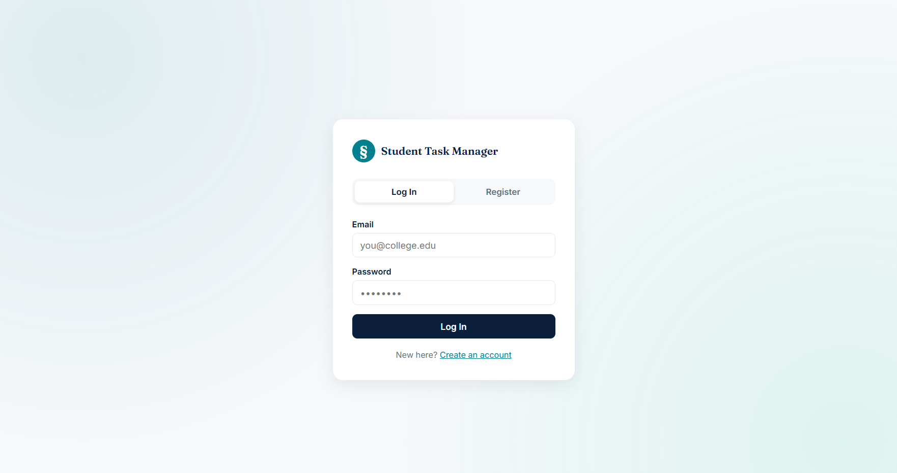
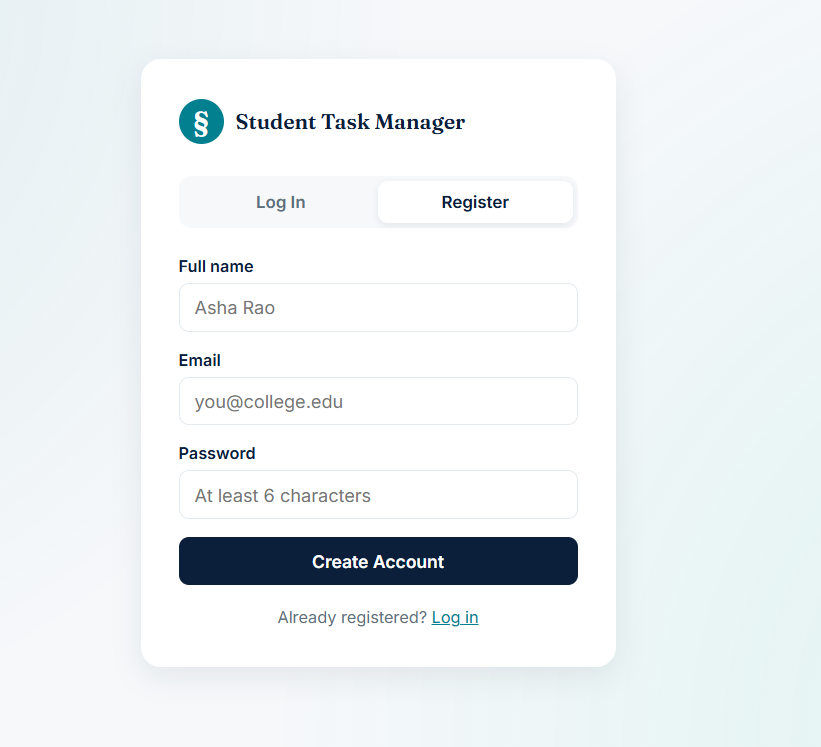
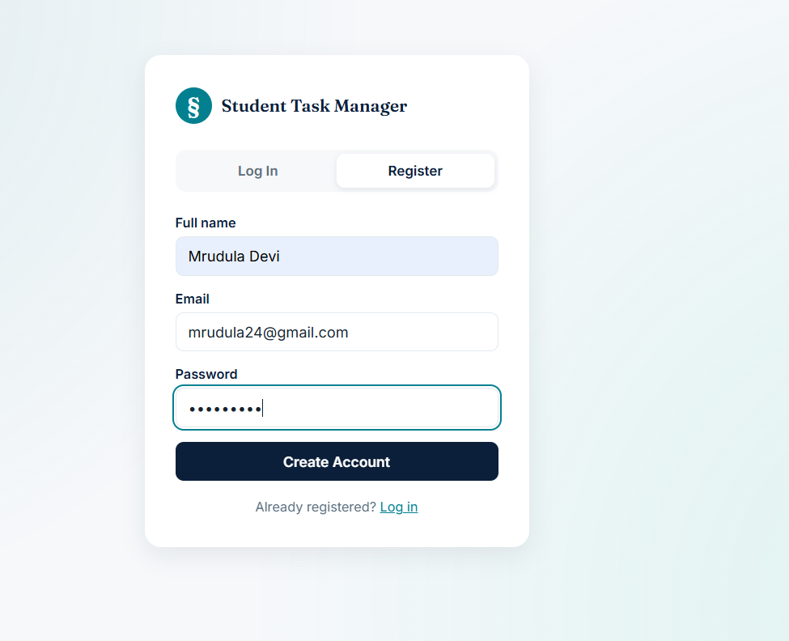
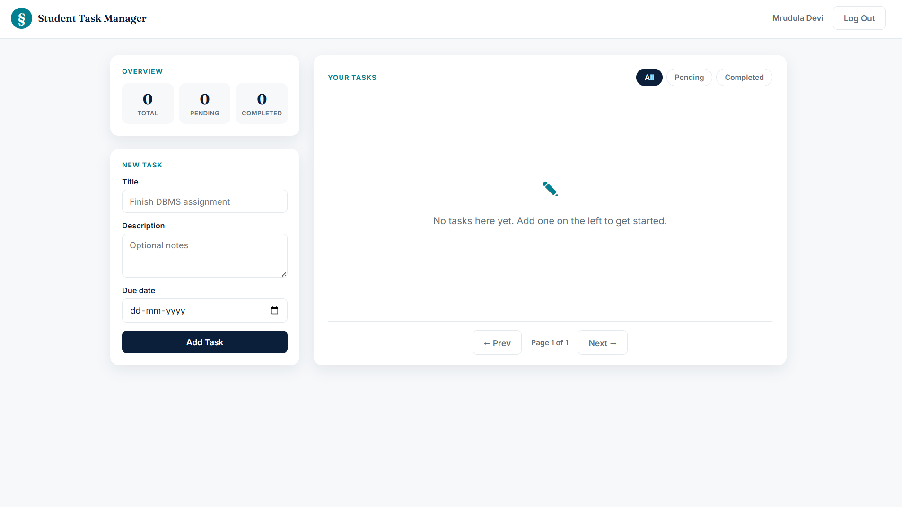
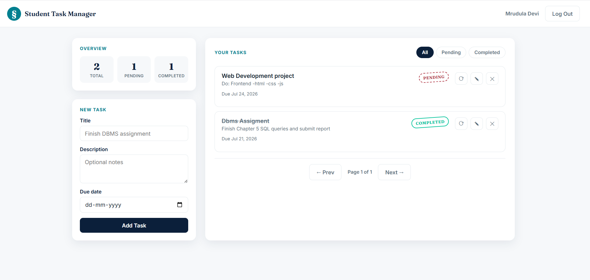

# Student Task Management System

A RESTful backend API that allows students to register, log in, and manage their academic tasks (create, view, update, mark complete/pending, and delete), secured with JWT authentication.

## Features

- User registration and login with hashed passwords (bcrypt)
- JWT-based authentication and protected routes
- Create, read, update, and delete tasks
- Dedicated endpoint to toggle task status (Pending / Completed)
- Per-user data isolation — a user can only see and modify their own tasks
- Centralized error handling and input validation
- Pagination and status filtering on the task list endpoint

## Tech Stack

| Layer | Technology |
|---|---|
| Runtime | Node.js |
| Framework | Express.js |
| Database | MongoDB + Mongoose |
| Auth | JWT + bcryptjs |
| Config | dotenv |
| Dev tooling | Nodemon |
| API testing | Postman |

## Folder Structure

```
student-task-management/
│
├── server.js               # App entry point — middleware, routes, server start
├── package.json
├── .env.example             # Template for environment variables
│
├── config/
│   └── db.js                # MongoDB connection logic
│
├── models/
│   ├── User.js               # User schema + password hashing hook
│   └── Task.js                # Task schema
│
├── controllers/
│   ├── authController.js       # Register / login business logic
│   └── taskController.js        # Task CRUD business logic
│
├── routes/
│   ├── authRoutes.js             # /api/auth endpoints
│   └── taskRoutes.js              # /api/tasks endpoints (JWT-protected)
│
├── middleware/
│   ├── auth.js                     # Verifies JWT, attaches req.user
│   └── errorHandler.js              # 404 + centralized error responses
│
├── utils/
│   └── validators.js                 # Request body validation helpers
│
└── README.md
```

**Why this structure?** Each layer has one job: routes map URLs to controller functions, controllers contain business logic, models define the data shape, middleware handles cross-cutting concerns (auth, errors), and config/utils hold setup and helpers. This keeps files small and makes it easy to find and change any single piece of behavior.

## Database Design

**Users Collection**

| Field | Type | Notes |
|---|---|---|
| _id | ObjectId | Auto-generated |
| name | String | Required |
| email | String | Required, unique |
| password | String | Required, stored as bcrypt hash |
| createdAt | Date | Auto (timestamps) |
| updatedAt | Date | Auto (timestamps) |

**Tasks Collection**

| Field | Type | Notes |
|---|---|---|
| _id | ObjectId | Auto-generated |
| userId | ObjectId | References User._id (owner of task) |
| taskTitle | String | Required |
| description | String | Optional |
| status | String | Pending or Completed, default Pending |
| dueDate | Date | Required |
| createdAt | Date | Auto (timestamps) |
| updatedAt | Date | Auto (timestamps) |

**Relationship:** One-to-many — one User owns many Task documents, linked via `Task.userId`. Every task query is scoped by `userId` (taken from the JWT), so users can never see or modify each other's tasks.

## API Documentation

Base URL: `http://localhost:5000/api`

### Auth

**Register — `POST /api/auth/register`**
Public.

Request body:
```json
{ "name": "Asha Rao", "email": "asha@example.com", "password": "secret123" }
```

Success (201):
```json
{ "success": true, "message": "User registered successfully", "data": { "user": {"id": "...", "name": "Asha Rao", "email": "asha@example.com"}, "token": "<jwt>" } }
```

Errors: `400` invalid input or email already registered.

**Login — `POST /api/auth/login`**
Public.

Request body:
```json
{ "email": "asha@example.com", "password": "secret123" }
```

Success (200): same shape as register, with a fresh token. Errors: `400` missing fields, `401` invalid credentials.

### Tasks

All task routes require header: `Authorization: Bearer <token>`

| Method | Endpoint | Description |
|---|---|---|
| POST | /api/tasks | Create a task |
| GET | /api/tasks | List your tasks (supports `?status=Pending`, `?page=`, `?limit=`) |
| GET | /api/tasks/:id | Get one task by id |
| PUT | /api/tasks/:id | Update a task's fields |
| PATCH | /api/tasks/:id/status | Update only the status |
| DELETE | /api/tasks/:id | Delete a task |

Create task — request body:
```json
{ "taskTitle": "Finish DBMS assignment", "description": "Chapter 4 exercises", "dueDate": "2026-07-10" }
```

Update status — request body:
```json
{ "status": "Completed" }
```

Standard error responses:

| Code | Meaning | When it happens |
|---|---|---|
| 400 | Bad Request | Validation failure |
| 401 | Unauthorized | Missing/invalid/expired JWT, wrong credentials |
| 404 | Not Found | Route or resource doesn't exist |
| 500 | Internal Server Error | Unexpected server-side failure |

## Installation & Setup

Requirements: Node.js ≥ 18, MongoDB (local install or Atlas cluster), npm.

```bash
# 1. Install dependencies
npm install

# 2. Configure environment
cp .env.example .env
# then edit .env with your MongoDB URI and a strong JWT_SECRET

# 3. Run in development (auto-restart on changes)
npm run dev

# 4. Or run in production mode
npm start
```

The server starts on `http://localhost:5000` by default (health check at `GET /`).

## Testing with Postman

1. Register a user via `POST /api/auth/register` and copy the returned token.
2. In Postman, set an environment variable `token` to that value.
3. For every `/api/tasks/*` request, add header `Authorization: Bearer {{token}}`.
4. Test create → list → get by id → update → status update → delete, in that order.

## Screenshots

**Log in**


**Register**


**Register — filled out**


**Dashboard — no tasks yet**


**Dashboard — one task added**


**Dashboard — multiple tasks, one completed**


## Future Improvements

- Frontend (React) client
- Task categories/tags and due-date reminders
- Refresh tokens and logout/blacklisting
- Rate limiting and request logging
- Unit and integration tests (Jest + Supertest)

## License

MIT
